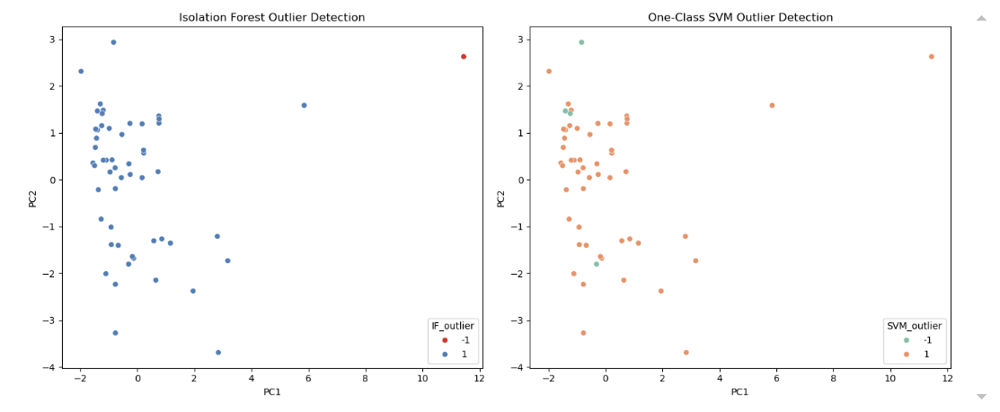

# Pillar-3-Credit-Risk-Outlier-Detection
Outlier detection in UK banks' Pillar 3 CR6 data using unsupervised machine learning

#Outliers_README.md for Pillar 3 Outlier Detection Project

## NON-TECHNICAL EXPLANATION OF YOUR PROJECT
This project uses two machine learning algorithms to detect unusual or anomalous data in the Pillar 3 CR6 AIRB credit risk report.

## DATA
The data comes from the published Pillar 3 reports for 2024 from the following banks (including links):
 - HSBC (https://www.hsbc.com/-/files/hsbc/investors/hsbc-results/2024/annual/pdfs/hsbc-holdings-plc/250219-pillar-3-disclosures-at-31-december-2024.pdf?download=1)
 - NatWest Group (https://www.investors.rbs.com/~/media/Files/R/RBS-IR-V2/results-center/14022025/nwg-pillar-3-report.pdf)
 - Barclays Bank Group (https://home.barclays/content/dam/home-barclays/documents/investor-relations/ResultAnnouncements/FullYear2024Results/FY24-Barclays-Bank-PLC-Pillar-3-Report.pdf)
 - Lloyds Banking Group (https://www.lloydsbankinggroup.com/assets/pdfs/investors/financial-performance/lloyds-banking-group-plc/2024/q4/2024-lbg-fy-pillar-3.pdf)
 - Santander (https://www.santander.com/en/shareholders-and-investors/financial-and-economic-information/pillar-3-disclosures-report)
 - Standard Chartered (https://www.sc.com/en/investors/financial-results/)

 The tables used were the CR6 summary for each of the exposure classes: Central Governments or Central Banks; Institutions; Corporates - Non-SME/other, Corporates -  SME, Corporates - Specialised Lending, Retail - Secured by real estate - Other, Retail - Secured by real estate - SME, Other Retail - Non SME, Other Retail - SME, Qualifying Revolving.

 The data captured in each summary was: Original exposure (On balance sheet); Original exposure (Off balance sheet); Average CCF; Exposure at default (post CCF); Average Probability of Default (PD); Obligor number, Average loss given default (LGD), Average maturity, Risk Weighted Assets (RWA), RWA as a percentage of EAD, Expected loss (EL), Provisions.

 Data was extracted from the PDFs to Excel using Camelot. Data was normalised and any blanks filled in as well as any correlations noted. The data was also scaled as the data points have widely different scales.

 See 01_Data_Exploration.ipynb file.
 The output of the cleaning and scaling was saved to the CR6_cleaned_scaled.csv file.

## MODEL 
As we do not have labelled outliers, unsupervised models were appropriate. Two were used:
Isolation forest - detects outliers by isolating the points that give fewer splits in random decision trees.
One-Class SVM - learns a boundary around "normal" data and flags any points outside of this boundary as outliers.

See 02_Modelling_Outliers.ipynb file.

## HYPERPARAMETER OPTIMSATION
Hyperparameters in these models are below:
Isolation forest: n_estimators; max_samples; contamination; max-features
One-Class SVM: nu; gamma

The objective of hyperparameter optimisation was to minimise the number of outliers while maintaining sensitivity of results. 

Optuna was used for hyperparameter optimisation in order to choose the best hyperparameters.

Optuna runs trials using different hyperparameter combinations then uses Bayesian optimisation to try different values to get better results. It improves the scores with each trial and after a set number of trials reports the best hyperparameters.
The number of trials can be modified, but 100 were used here as a test. In order to determine the best number of trials needed to optimise the parameters, the results were plotted. 

Details of the outliers were output to the "Outlier_Predictions.csv" file.

## RESULTS
The isolation forest detected one outlier, while the One-Class SVM detected four outliers. The PCA plots visalised how these outliers were separated, see image below:

Pseudo-cross validation was also run to test for model stability, which suggested that the model is detecting very flow outliers (which is expected) but that it is also inconsistent across folds. This is likely due to the small dataset size, and is likely to improve as other Pillar 3 tables are added to the dataset.
